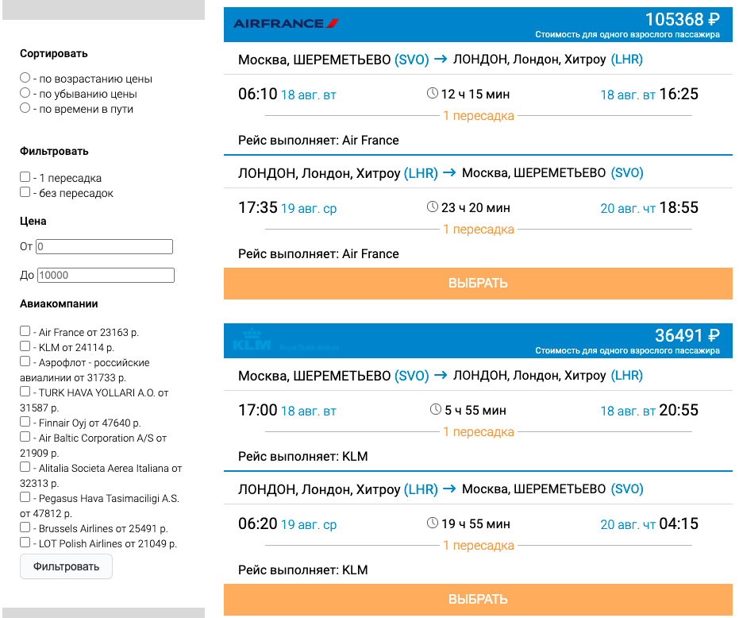

# Gridnine Frontend Test

Тестовое задание на позицию JavaScript Developer для компании Gridnine

### Оглавление

- [Обзор](#обзор)
  - [Задание](#задание)
  - [Скриншот](#скриншот)
  - [Ссылки](#ссылки)
- [Разработка](#разработка)
  - [Инструменты](#инструменты)
  - [Todo](#todo)
- [Автор](#автор)

## Обзор

### Задание

Пользователи могут:

- Видеть список полётов
- Соритровать список (по возрастанию цены, по убыванию, по времени в пути)
- Фильтровать список (по количеству пересадок, по цене, по конкретным авиакомпаниям)

Технические требования:

- Приложение написано на React
- логотип авиакомпаний загружается динамически при помощи API Aviasales

### Скриншот

### Ссылки

[Live Website](https://davidbraginsky.github.io/gridnine_frontend_test/)

## Разработка

### Инструменты

- React (18.1)
- SCSS
- ESLint
- Json-server

Для того, чтобы запустить приложение локально склонируйте репозиторий. После установите все зависимости при помощи `npm install`. Запустите приложение при помощи `npm run serve`.

### Todo

## Автор

[@davidbraginsky](https://github.com/davidbraginsky)
